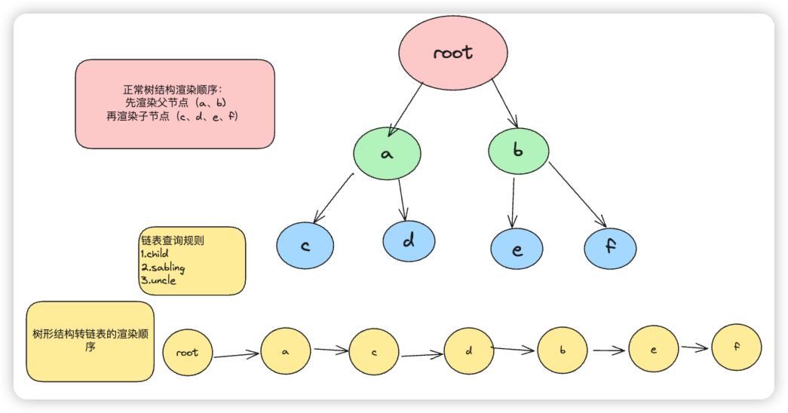

# 今日学习目标 ：

# 实现任务调度器/实现 fiber架构

## 课程大纲

### 问题1 ：dom树特别大，导致渲染卡顿

#### 解决思路：把大任务拆分成多个 task中去完成

#### 实现：采用 requestIdleCallback分帧运算

### 问题2： 如果做到每次只渲染几个节点？在下次执行时依然从之前的位置执行

#### 解决思路：把树结果转变成链表结构

1. child
2. sibling
3. parent

#### 实现：performUnitOfWork（执行任务函数）

1. 创建 DOM
2. 把 DOM添加到父容器内
3. 设置 dom的 props
4. 建立关系 child sibling parent
5. 返回下一个节点

## 解析、拆分大纲

1. 理解 dom树太大，导致渲染卡顿的原理
2. 理解解决思路：链表
3. 熟悉/掌握requestIdleCallback()函数相关 api
4. 实现performUnitOfWork，将树结构转化为链表

## 学习步骤

### 1.js为单线程，js在处理运算逻辑花费时间过长的话，会阻塞后续渲染

```js
let i = 0
// i<10000 的运算时间和i < 10000000000 是不同量级的，肉眼可见的在 loading
while (i < 10000000000) {
  i++
}
//
```

### 2.提出解决方案

#### 之前的方案：

使用递归渲染
优点：代码简洁，便于理解；对于未知深度的代码可以较好的处理
弊端：如果量过大，会卡顿，阻塞渲染（性能开销大）；栈溢出；可读性和可维护性较差

#### 解决的方案：

使用链表拆分成多个任务，每个任务至渲染几个组件
优点：不会阻塞渲染

### 2.空闲时间调用函数

```js
function workLoop(deeLine) {
  //默认不让步
  let shouldYield = false
  
  while (!shouldYield && nextWorkOfUnit) {
    //run task
    nextWorkOfUnit = performUnitOfWork(nextWorkOfUnit)
    shouldYield = deeLine.timeRemaining() < 1
  }
  requestIdleCallback(workLoop)
}

requestIdleCallback(workLoop)
```

利用每次循环空闲时间将处理任务，并记录下一次的任务

### 3.链表

#### 了解查询规则

1. 向下找子节点,找不到返回
2. 找不到子节点后再找当前节点的兄弟节点，找不到返回
3. 找不到兄弟节点就找叔叔节点
   

```js
//该方法为查询规则的具象化体现
function performUnitOfWork(filber) {
//......
     
  //4. 返回下一个要执行的任务
  //这里对应了查询规则 1查儿子 2查兄弟 3查叔叔
  if (filber.child) {
    return filber.child
  }
  if (filber.sabling) {
    return filber.sabling
  }
  
  return filber.parent?.sibling
}
```

##### 核心内容

```js
//构建链表的核心逻辑，创建链表数据结构
function initChildren(filber) {
  const children = filber.props.children//设置子节点
  let prevChild = null//上一个子节点
  children.forEach((child, index) => {
    const newFilber = {
      type: child.type,
      props: child.props,
      child: null,
      parent: filber,
      sabling: null,
      dom: null
    }
    //主流程，一直记录子节点
    if (index === 0) {
      filber.child = newFilber//记录子节点
    } else {
      prevChild.sibling = newFilber//记录兄弟节点
    }
    //每次循环结束时记录上一个子节点（存档）
    prevChild = newFilber
  })
}
```

其中声明`newFilber`对象则是为了不破坏vdom结构，避免污染问题

## 第二天总结

在上班中零零散散的看完了视频并消化了很多，差不多用了 3 个多小时，问题太多了，即便我习惯一开始把大纲梳理处理，看完视频后再把大纲细化、补全，再去敲代码，也还是无从下手。今天的难度相当高了，崔哥在第二个视频中讲解的顺序有一点点乱，不过梳理过一遍流程后也就没什么大问题了。今天最大的几个收获消化今天课程内容倒是其次，对于抽离代码的思维方式崔哥给了很好的提示，让我受益匪浅
